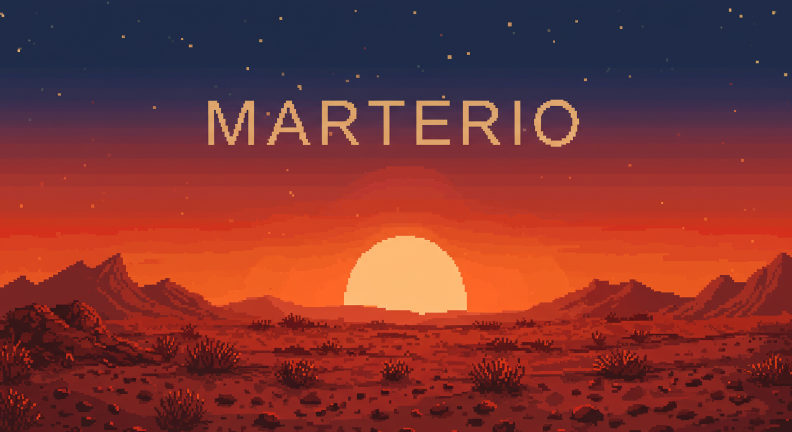

# Marterio: A Martian Colony Adventure   

  

Embark on a journey to the red planet in Marterio, a colony management and exploration game that blends a cozy charm gameplay with the unpredictable wilds of Mars. 
Rendered in lovely 2D visuals , this is more than a tale of building and farming—it’s a living, breathing adventure where time shapes your fate and AI-powered characters (AIPCs) hold the power to uplift or destroy your dreams.  

As a Martian colonist , you’ll construct a thriving settlement , explore uncharted landscapes , and manage resources under the ticking clock of predefined events: on day 100, transmissions with Earth  abruptly end; by day 200, mysterious UFOs  appear overhead. These moments punctuate your journey, testing your resilience and altering your story. But the true heart of Marterio lies in its AIPCs—humans and aliens  alike—who don’t just follow scripts. They act, adapt, and interact with the world , forging alliances , sparking conflicts , or even turning against you if tensions boil over. One misstep, and your own settlers could become your downfall. 

Will you nurture a utopian colony beneath the Martian sky , or will the isolation and the AIPCs’ emergent behaviors plunge you into a psychological thriller? Every playthrough is unique, driven by your choices and the whims of your unpredictable companions.  

***Key Features:***
- Colony Management & Exploration: Build a bustling settlement and uncover the secrets of Mars, from hidden resources to alien encounters.  

- Dynamic AIPCs: Engage with AI-driven characters who evolve with each run—helpers one day, threats the next—shaping a story that’s never the same twice.  

- Time-Based Events: Face pivotal moments like losing Earth contact on day 100 or UFO sightings on day 200, adding urgency and surprises to your tale.  

- Diverse Outcomes: Craft a peaceful utopia or survive a chilling nightmare, depending on your decisions and the AIPCs’ actions.  

- Cozy Visuals: Immerse yourself in a warm, inviting 2D art style that makes Mars feel like a home worth fighting for.

In Marterio, every day is a gamble, every alliance fragile. Will you conquer the red planet’s challenges, or will its mysteries—and your own creations—consume you? Step into the dust and find out.  

